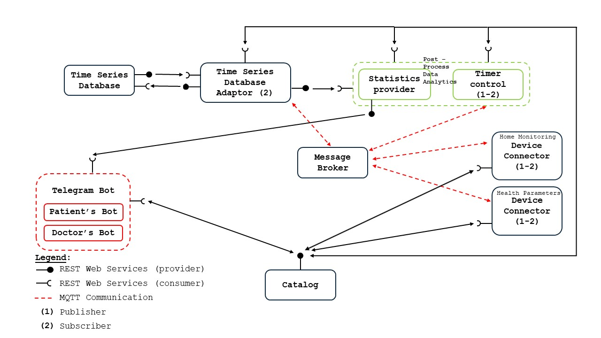

# IoT Platform for Patient Health Monitoring

An IoT platform for monitoring patients' health at home, built as a microservices system communicating over MQTT (publish/subscribe) and REST (request/response).

## Overview

| | |
|---|---|
| **Scope** | Provides services for monitoring patients' health conditions while they are at home. |
| **Objective** | Simplify health monitoring for doctors by letting patients record medical parameters remotely, with data made available to the doctor. |
| **Domain** | Smart Health, Smart Medicine |
| **Stakeholders** | Hospitals, Doctors, Patients |

A Raspberry Pi 3 acts as the central hub, collecting sensor data and communicating with remote services via MQTT and REST APIs. A Telegram-based interface handles data visualization and monitoring for both doctors and patients.

## Architecture

The system follows a microservices design pattern with two communication paradigms:
- **Publish/subscribe** — MQTT protocol, via a central Message Broker
- **Request/response** — REST web services

### Components

| Component | Responsibility |
|---|---|
| **Catalog** | Stores patient and service registration data; exposed via REST so other microservices can query/update it. |
| **Device Connector (Home Monitoring)** | Reads room temperature sensors, publishes readings over MQTT, and subscribes to actuation commands from Timer Control. |
| **Device Connector (Health Parameters)** | Reads Bluetooth health sensors and publishes readings over MQTT, based on parameters the doctor enables via the Catalog. |
| **Timer Control** | Compares incoming home-temperature data against desired setpoints from the Catalog and issues actuation commands over MQTT. |
| **Message Broker** | Provides asynchronous MQTT-based communication between services. |
| **Time Series Database Adaptor** | Subscribes to health and temperature topics and persists data to the Time Series Database via REST; also serves the Statistics Provider. |
| **Time Series Database** | Stores historical sensor data and periodic statistics. |
| **Statistics Provider** | Aggregates and interprets stored data (e.g. comparisons to historical values) for the User Awareness layer. |
| **User Awareness (Telegram Bots)** | Two bots — one for doctors (register patients, select active sensors, view patient stats), one for patients (manage rooms, set desired temperature, view personal data/stats). |

## Tech Stack

- **Hub:** Raspberry Pi 3
- **Messaging:** MQTT (publish/subscribe)
- **APIs:** REST
- **User interface:** Telegram Bot API
- **Storage:** Time-series database

## Team

- Mohamad Abdallah
- Andrea Vola
- Francesco Vurchio
- Marcelo Venturini
